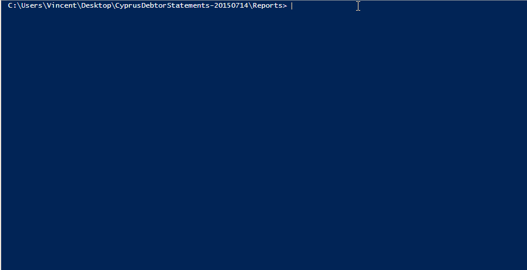

## PScript to manipulate rdlc Page Settings

### Summary

The 2008 ReportViewer Control used to display SSRS local reports within a desktop application does not provide the possibility to programmatically set the Page Margin, Paper Size, etc... of the RDLC ReportViewer Pagesetup dialog. These settings are controlled at the report definition level.

Refer to [this msdn forum thread](https://social.msdn.microsoft.com/Forums/en-US/590f37b4-af7b-4659-bbfe-3dd5952e693e/programatically-get-set-the-page-margin-paper-size-etc-from-rdlc-reportviewer-pagesetup?forum=vsreportcontrols)

To allow users to adjust & persist these settings, a work around is to **not** embed the rdlc file within the executable and instead load the report as an external dependency. Additionally, to avoid the need to load the report definition in a report builder, this little PowerShell script can quickly guide a user through the process of updating these settings within the report.

### Demo & Explanation

Kindly refer to the below animation for a quick demo of how the script can be used:

Explanation:
In the above animation the current settings are first displayed when the script is ran.

When prompted to adjust the current settings, pressing <kbd>y</kbd> followed by <kbd>enter</kbd> will take you through each setting,

For each setting, pressing <kbd>enter</kbd> will keep the original value. If a new value is entered, this value will replace the original value. 

Please note: the entered values are **not** validated and need to be entered
exactly in the same notation as current values (including units).

Once values have been prompted for all settings, the script will ask to confirm if the new values should be assigned and written to disk. pressing <kbd>n</kbd> followed by <kbd>enter</kbd> will ensure the original settings remain unchanged.

As a final part of the animation, the current settings are reloaded to prove the data was stored, this time opting not to make any changes (which allows the script to be used, just to display the current settings).